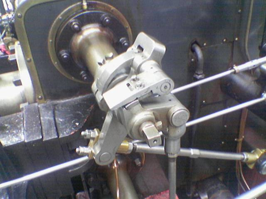
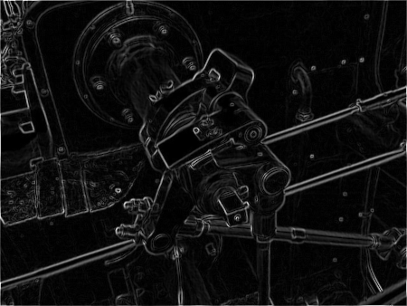
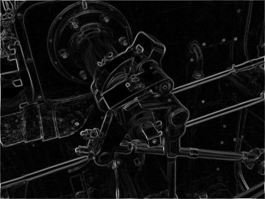
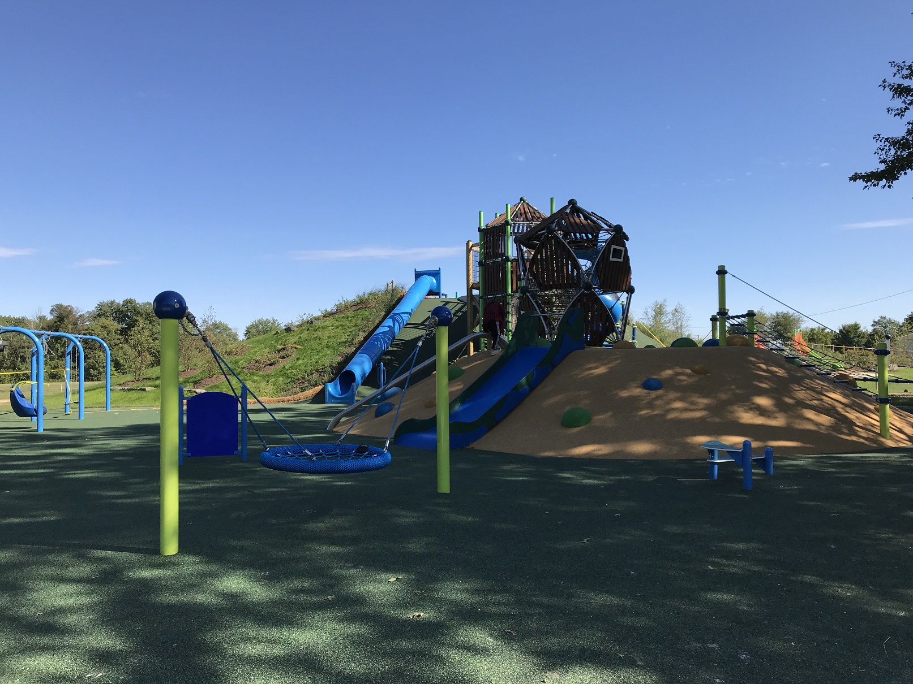
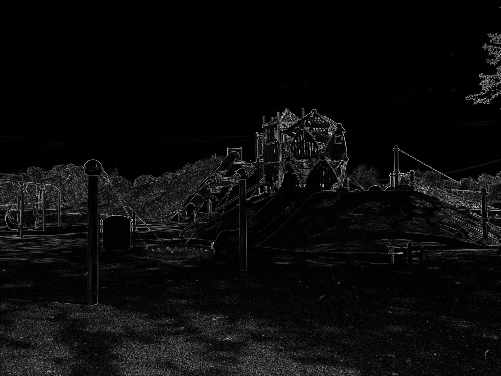

# image_energy_map

[Sobel operator](https://en.wikipedia.org/wiki/Sobel_operator)

 

Original image (./source/valve.png):    
   

Energy map using L1 norm (./output/valve_energy_map_L1.png):    
   

Energy map using L2 norm (./output/valve_energy_map_L2.png):     
   

Original image (./source/kids_mountain.jpg):    
   

Energy map using L1 norm (./output/kids_mountain_energy_map_L1.png):    
   

Energy map using L2 norm (./output/kids_mountain_energy_map_L2.png):     
   
