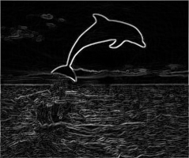
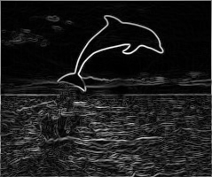

# image_energy_map
visualize the energy map

Original image (./source/dolphin.png):    
   

Energy map using L1 norm (./output/dolphin_energy_map_L1.png):    
   

Energy map using L2 norm (./output/dolphin_energy_map_L2.png):     
   
